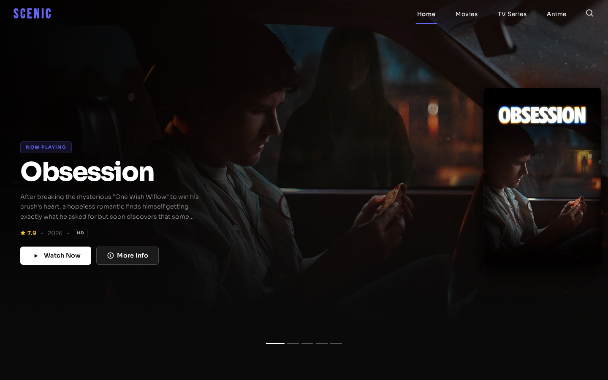
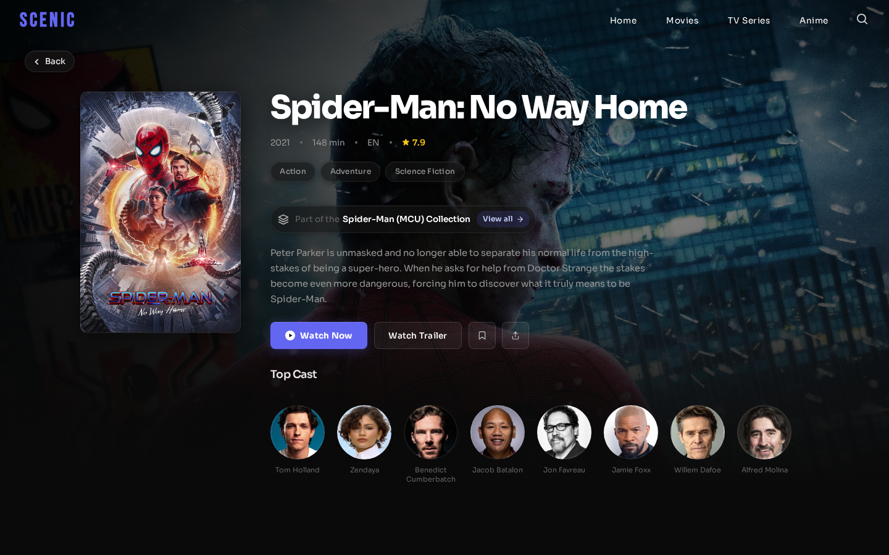
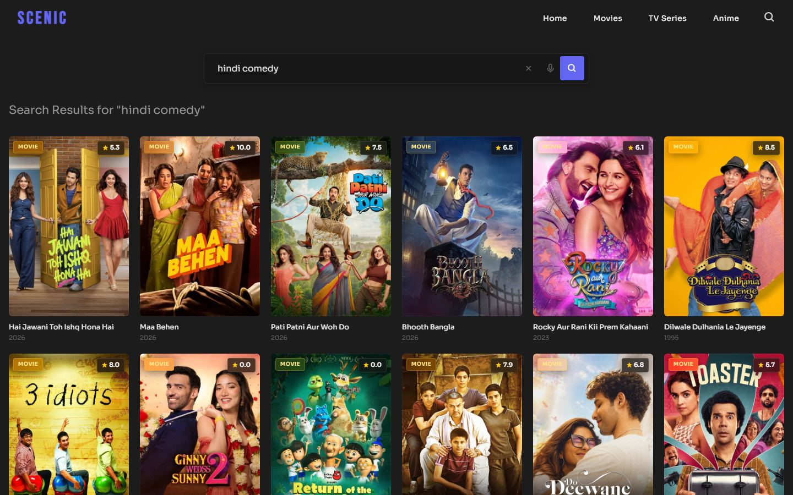
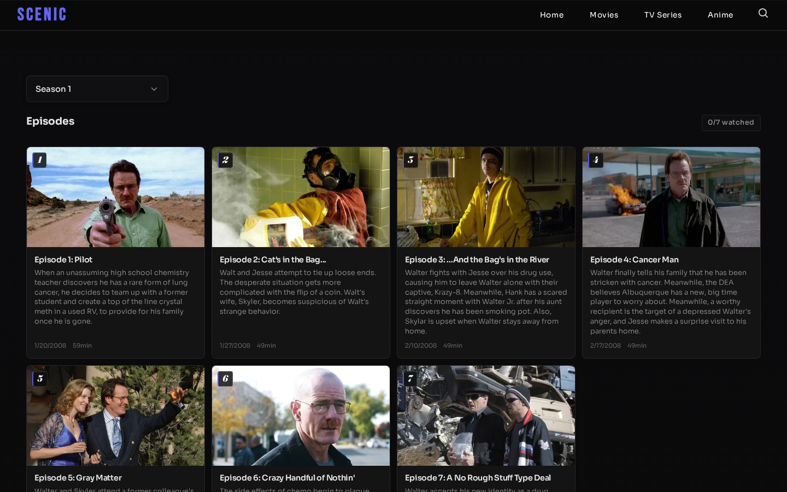
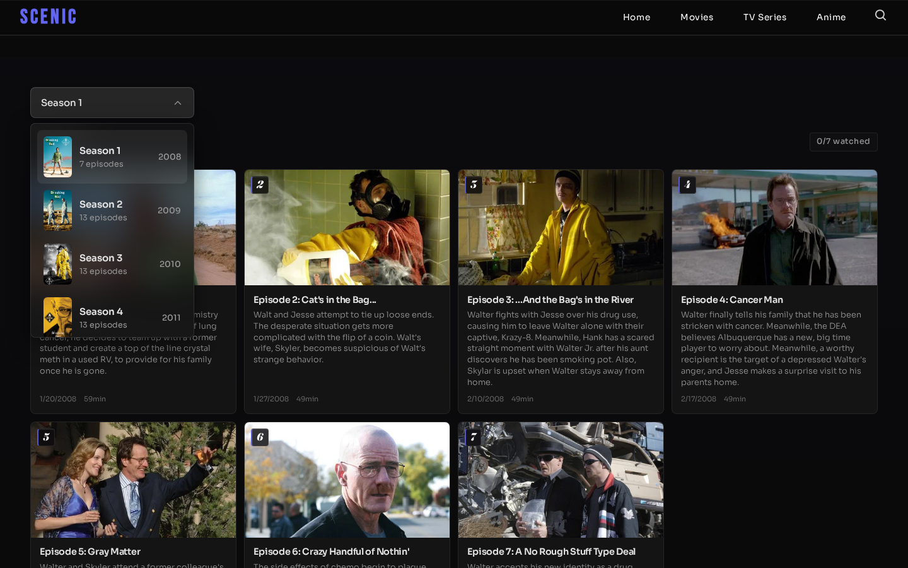
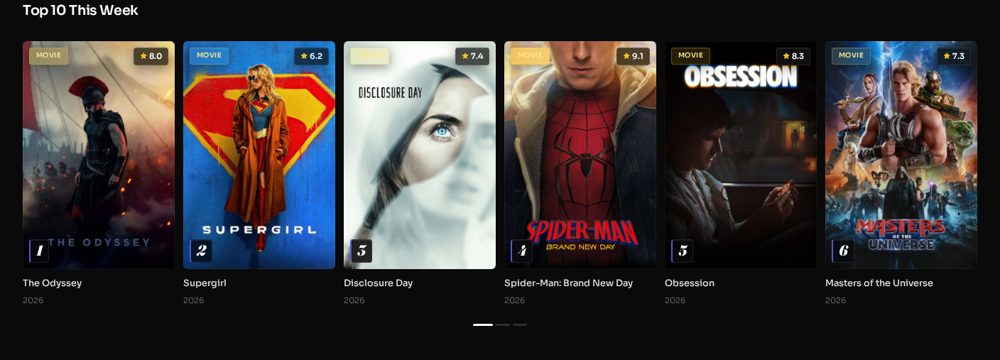
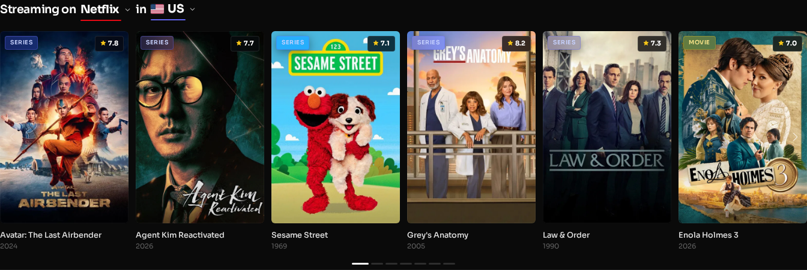
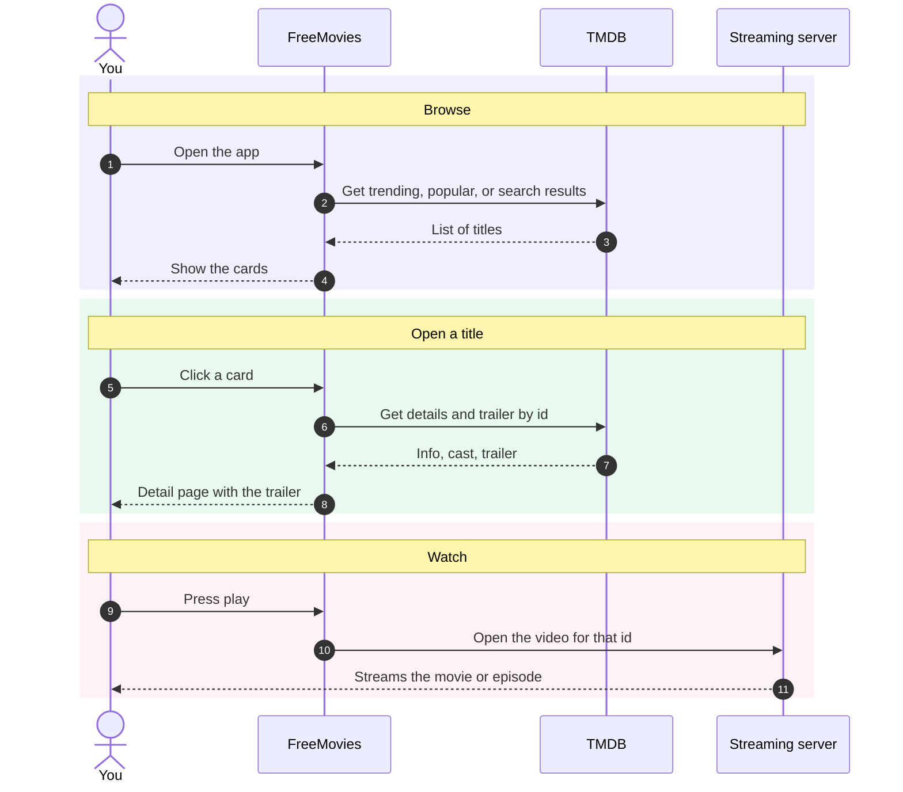
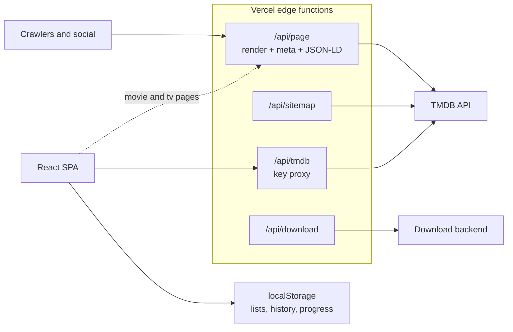

<div align="center">


# FreeMovies

Stream movies, TV series, and anime from various publicly available servers, for free. Whether you're searching for the latest blockbuster or discovering a hidden gem, FreeMovies has you covered.

[](https://scenic-stream.vercel.app)
[](https://www.themoviedb.org)
[](LICENSE)

[Live demo](https://scenic-stream.vercel.app) · [Report a bug](https://github.com/vanshaj-pahwa/scenic/issues/new?labels=bug) · [Request a feature](https://github.com/vanshaj-pahwa/scenic/issues/new?labels=enhancement)

</div>

<p align="center"></p>

## Table of contents

- [About](#about)
- [Features](#features)
- [Tech stack](#tech-stack)
- [Screenshots](#screenshots)
- [How it works](#how-it-works)
- [Under the hood](#under-the-hood)
- [Getting started](#getting-started)
- [Environment variables](#environment-variables)
- [Available scripts](#available-scripts)
- [Application routes](#application-routes)
- [SEO and performance](#seo-and-performance)
- [Contributing](#contributing)
- [License](#license)
- [Acknowledgements](#acknowledgements)
- [Author](#author)
- [Disclaimer](#disclaimer)

## About

FreeMovies is a web app for finding and watching movies, TV series, and anime. It uses [The Movie Database (TMDB)](https://www.themoviedb.org) for data, understands plain-language search such as "punjabi movies", "movies like inception", or "directed by nolan", plays trailers inline, and remembers what you were watching.

There is no sign-up and no backend database. Your watchlist, continue-watching history, and episode progress are stored in the browser with `localStorage`. Movie and TV detail pages are rendered at the edge so links preview correctly and search engines can read them; the rest of the app is a single-page app.

## Features

### Discovery

- Trending Today and a ranked Top 10 This Week, for both movies and TV.
- An auto-playing hero carousel of top titles with backdrop art and quick actions.
- Hidden Gems: highly rated titles (7.5+ with a reasonable vote count) that don't usually surface.
- A dedicated anime section with its own catalog, rows, and sorting.
- Collection pages: a movie that belongs to a franchise links to a watch-order page for the whole series.
- A "where to watch" view that shows which titles are streaming on Netflix, Prime, and others in your region, with a searchable region and provider picker.
- Genre and country filters on every catalog and type page (Popular, Top Rated, Now Playing, and so on).

### Search

- Plain-language search. Queries like "hindi comedy", "korean series", "2019 horror", "movies like inception", or "directed by nolan" are mapped to TMDB Discover, recommendations, or person credits with the right language, genre, year, and people filters. Plain titles fall back to full-text search.
- A global search overlay opened from the header icon or the `/` shortcut.
- A typewriter placeholder that cycles through what is trending right now.
- Autocomplete with poster thumbnails, highlighted matches, and type/year/rating.
- Voice search using the Web Speech API. The mic button only shows where the browser supports it.

### Playback

- Trailer takeover on detail pages. The muted trailer fades in over the backdrop (autoplay on touch and TV, hover to play on desktop), the poster fades out so the footage fills the banner, and a mute/stop control sits in the corner. It pauses off screen and is removed the moment you start watching, so it never plays over the actual video.
- Streaming from 10+ configurable servers, with a server selector.
- A TV series player with a season and episode selector, previous/next navigation, and saved progress.
- YouTube trailers in a modal from any detail page.
- An optional download button that checks availability per title and proxies through a configurable backend.

### Personalization (browser-local, no account)

- My List: bookmark anything to a watchlist that persists locally and updates everywhere in the app at once, with undo on removal.
- Continue Watching: recently opened titles resume on the home page and remember the exact season and episode you stopped on, with a progress bar.
- Because You Watched: recommendations based on your recent activity.

### Interface

- Skeleton placeholders on grids, rows, and the detail banner while content loads.
- A route-progress bar across the top on navigation.
- Scroll restoration, so returning from a detail page lands you where you were in the grid.
- Keyboard and TV-remote navigation throughout (arrows, focus handling, submit on Enter).
- Layouts for mobile (with a bottom nav), tablet, and desktop.
- Native share with a copy-link fallback.

## Tech stack

| Layer | Tools |
|-------|-------|
| Framework | [React 18](https://react.dev), [React Router DOM v6](https://reactrouter.com) (Create React App) |
| Styling | [SCSS](https://sass-lang.com), [Mantine](https://mantine.dev) |
| Animation | [Framer Motion](https://www.framer.com/motion/), [Swiper](https://swiperjs.com), CSS transitions |
| Data | [TMDB API](https://developer.themoviedb.org) |
| HTTP | [Axios](https://axios-http.com) with interceptors |
| Browser APIs | Web Speech (voice search), `localStorage` (watchlist, history, progress) |
| Edge functions | [Vercel](https://vercel.com/docs/functions) for the TMDB proxy, detail-page rendering, sitemap, and download proxy |
| Icons | [Boxicons](https://boxicons.com), [Font Awesome](https://fontawesome.com) |

## Screenshots

<table width="100%">
  <tr>
    <td width="50%" align="center"><br><sub>Title detail</sub></td>
    <td width="50%" align="center"><br><sub>Search results</sub></td>
  </tr>
  <tr>
    <td align="center"><br><sub>Episode list</sub></td>
    <td align="center"><br><sub>Season picker</sub></td>
  </tr>
</table>

<p align="center"><br><sub>Top 10 this week</sub></p>

<p align="center"><br><sub>Streaming by provider and region</sub></p>

See it all on the [live demo](https://scenic-stream.vercel.app).

## How it works

FreeMovies gets all its movie and show information - titles, posters, cast, ratings, and trailers - from TMDB. It does not store any video itself. When you press play, it loads the video from streaming servers that are already public on the internet.

Here is the journey, from opening the app to watching something:

1. **Browse.** The home and catalog pages ask TMDB for lists (trending, popular, top rated, or whatever you searched) and show them as cards.
2. **Open a title.** Clicking a card opens its detail page using that title's TMDB id, then loads its info, cast, recommendations, and trailer.
3. **Watch.** When you press play, FreeMovies builds a link from that TMDB id (plus the season and episode for shows) and loads the video from one of the streaming servers. If one is down, you can switch to another.



FreeMovies does not host or store any video. The streaming sources are third-party servers that are already publicly available; the app only embeds them (set through environment variables), and all metadata comes from TMDB.

## Under the hood

FreeMovies is a Create React App single-page app with a few Vercel edge functions for things a static SPA cannot do on its own: hiding the API key, rendering detail-page meta tags for link previews and SEO, and proxying downloads.



- `src/api` holds `axiosClient`, `apiConfig`, and `tmdbApi`; all TMDB access goes through here.
- `src/utils` powers search and persistence: `parseSmartQuery` and `searchResolver` turn a plain-language query into TMDB calls, and `watchlist`, `continueWatching`, and `watchedEpisodes` are small `localStorage` stores that emit an event on change so every component stays in sync.
- `src/hooks` holds reusable behavior: search suggestions, the typewriter placeholder, document title, download availability, and keyboard navigation.
- `api/` holds the edge functions: `page.js` injects per-title meta tags and JSON-LD, `sitemap.js` builds the sitemap, and `vercel.json` wires up the routes.

## Getting started

Prerequisites:

- [Node.js](https://nodejs.org) v16 or newer, and npm
- A free [TMDB API key](https://www.themoviedb.org/settings/api)

Steps:

1. Clone the repository:

   ```bash
   git clone https://github.com/vanshaj-pahwa/scenic.git
   ```

2. Move into the project:

   ```bash
   cd scenic
   ```

3. Install dependencies:

   ```bash
   npm install
   ```

4. Create your `.env` file, then fill in your keys (see below):

   ```bash
   cp .env.example .env
   ```

5. Start the dev server:

   ```bash
   npm start
   ```

Then open http://localhost:3000.

## Environment variables

Create a `.env` file in the project root:

```env
# TMDB (required)
REACT_APP_API_KEY=your_tmdb_api_key      # client, in development
TMDB_API_KEY=your_tmdb_api_key           # edge functions (render, sitemap, proxy)

# Streaming servers (movie and TV pairs, up to 10)
REACT_APP_MOVIE_SERVER1=https://example.com/embed/movie/
REACT_APP_TV_SERVER1=https://example.com/embed/tv/
# ...repeat through REACT_APP_MOVIE_SERVER10 / REACT_APP_TV_SERVER10

# Downloads (optional)
DOWNLOAD_BASE_URL=https://your-download-backend.example.com
```

| Variable | Required | Used by | Purpose |
|----------|:--------:|---------|---------|
| `REACT_APP_API_KEY` | yes | client | TMDB requests during local development |
| `TMDB_API_KEY` | yes (prod) | edge functions | TMDB requests from `/api/page`, `/api/sitemap`, `/api/tmdb` |
| `REACT_APP_MOVIE_SERVERn` / `REACT_APP_TV_SERVERn` | yes | client | Streaming embeds (n = 1..10) |
| `DOWNLOAD_BASE_URL` | no | `/api/download` | Backend that resolves downloadable files |

On Vercel, add these under Project, Settings, Environment Variables.

## Available scripts

| Command | Description |
|---------|-------------|
| `npm start` | Run the dev server at localhost:3000 |
| `npm run build` | Production build into `build/` |
| `npm test` | Run the test runner |
| `CI=true npm run build` | Build with warnings treated as errors |

## Application routes

| Path | Page |
|------|------|
| `/` | Home: hero slider, trending, top rated, continue watching |
| `/movie`, `/tv` | Movie and TV catalogs with filters |
| `/anime` | Anime catalog |
| `/movie/type/:type`, `/tv/type/:type` | By type (popular, top_rated, now_playing, upcoming, on_the_air) |
| `/movie/:id`, `/tv/:id` | Detail page and player (rendered meta) |
| `/collection/:id` | Franchise watch-order page |
| `/person/:id` | Cast or crew member with filmography |
| `/my-list` | Saved watchlist |
| `/search`, `/search/:keyword` | Search results (title, voice, or plain language) |

## SEO and performance

- `vercel.json` rewrites `/movie/:id` and `/tv/:id` to `api/page.js`, which fetches the title from TMDB and injects a real `<title>`, a synopsis `<meta description>`, a canonical link, Open Graph and Twitter tags, and `Movie`/`TVSeries` JSON-LD (rating, cast, genres) into `index.html`.
- The home page carries `WebSite` and `Organization` JSON-LD, validated against Google's Rich Results Test.
- `/sitemap.xml` is served by `api/sitemap.js` and lists the landing pages plus trending, popular, and top-rated detail URLs. It is referenced from `robots.txt`.
- Routes are lazy-loaded, and the app uses skeleton placeholders, a route-progress bar, and scroll restoration.

## Contributing

Contributions are welcome.

1. Fork the repository.
2. Create a branch: `git checkout -b feature/your-feature`.
3. Commit: `git commit -m "feat: add your feature"`.
4. Push: `git push origin feature/your-feature`.
5. Open a pull request.

Run `CI=true npm run build` before submitting.

## License

MIT. See [LICENSE](LICENSE).

## Acknowledgements

- [The Movie Database (TMDB)](https://www.themoviedb.org) for the data and images.
- [Mantine](https://mantine.dev), [Framer Motion](https://www.framer.com/motion/), [Swiper](https://swiperjs.com), and [Boxicons](https://boxicons.com).

This product uses the TMDB API but is not endorsed or certified by TMDB.

## Author

Vanshaj Pahwa, [github.com/vanshaj-pahwa](https://github.com/vanshaj-pahwa).

## Disclaimer

FreeMovies is a personal, educational project. It does not host, upload, or store any video. It is a front-end that reads metadata from TMDB and embeds third-party streaming sources set through environment variables. All content rights belong to their respective owners. Use it in line with the laws of your country; the author is not responsible for content served by third-party sources.
